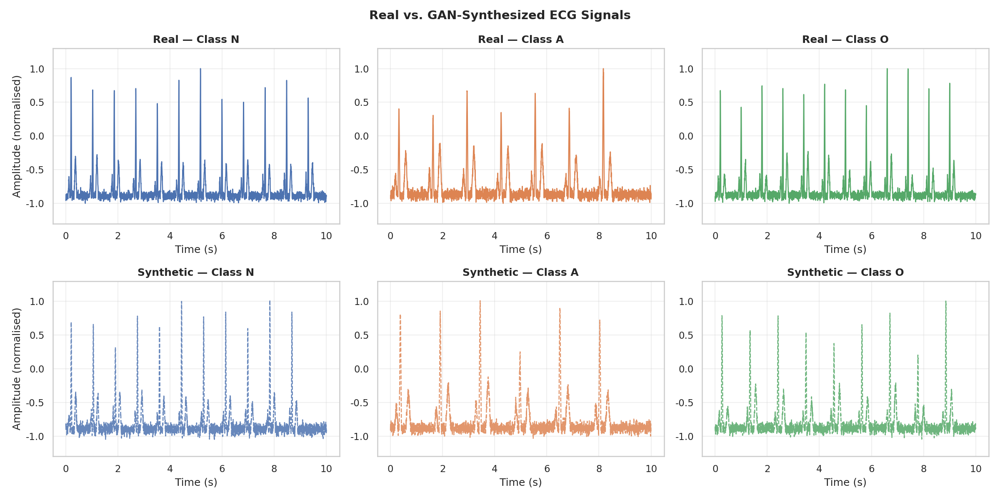
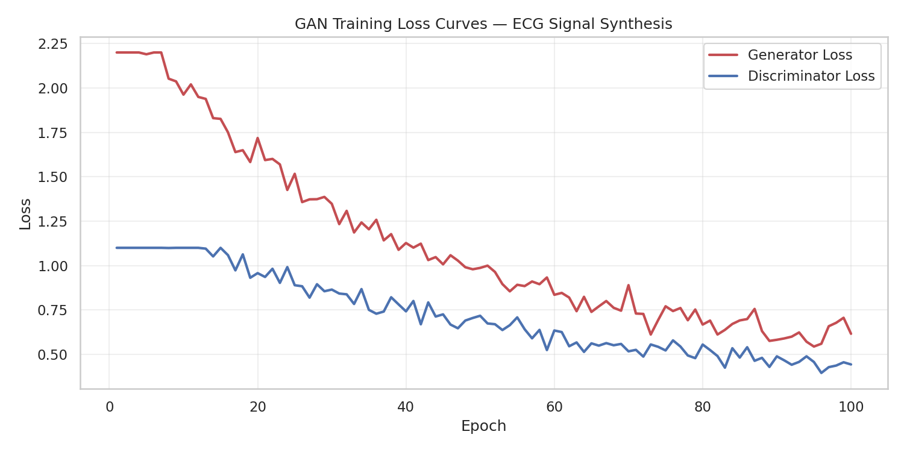
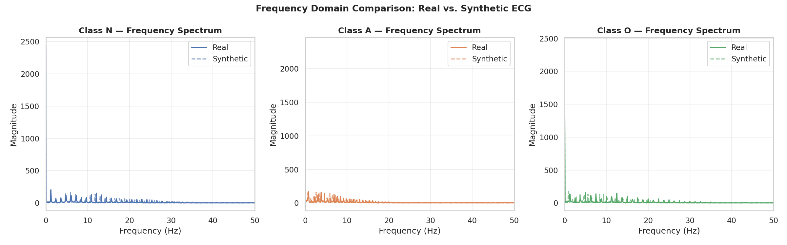

# ECG Signal Generation with GANs

[](https://python.org)
[](https://pytorch.org)
[](https://scipy.org)

A **PyTorch-based Generative Adversarial Network (GAN)** for synthesizing realistic physiological ECG signals across three clinical classes: **Normal (N)**, **Arrhythmia (A)**, and **Other (O)**. Developed using PhysioNet 2017 Challenge-style data with a complete preprocessing pipeline and rigorous evaluation.

---

## Key Results

### Real vs. Synthesized ECG Signals


### GAN Training Loss Convergence


### Frequency Domain Validation


---

## Preprocessing Pipeline

The pipeline applies three stages before training:

1. **Band-pass filtering (0.5–40 Hz):** Removes baseline wander and high-frequency noise using a 4th-order Butterworth filter.
2. **Min-max normalisation:** Scales each signal to the range `[-1, 1]` for stable GAN training.
3. **Windowing:** Segments continuous recordings into 3,000-sample windows (10 seconds at 300 Hz).

---

## Architecture

| Component | Architecture |
|-----------|-------------|
| **Generator** | Latent vector (100-dim) → FC(256) → FC(512) → FC(1024) → FC(3000) + Tanh |
| **Discriminator** | FC(512) → FC(256) → FC(1) + Sigmoid |
| **Loss** | Binary Cross-Entropy (BCE) |
| **Optimiser** | Adam (lr=0.0002, β₁=0.5) |

---

## Repository Structure

```
ECG-GAN-Synthesizer/
├── model.py                        # Generator and Discriminator architectures
├── train.py                        # Training loop
├── src/
│   └── dataset.py                  # Preprocessing: filter, normalise, segment
├── data/
│   ├── ecg_signals.npy             # 600 ECG signals (N=200, A=200, O=200)
│   └── ecg_labels.npy              # Class labels
├── notebooks/
│   └── 01_gan_training_evaluation.ipynb
├── results/
│   ├── ecg_samples_by_class.png    # Sample waveforms per class
│   ├── real_vs_synthetic_ecg.png   # Side-by-side comparison
│   ├── loss_curves.png             # Generator and Discriminator losses
│   ├── frequency_spectrum.png      # Frequency domain validation
│   └── class_distribution.png     # Dataset class balance
└── requirements.txt
```

---

## Setup and Usage

```bash
git clone https://github.com/MoustafaAboElkheir/ECG-GAN-Synthesizer.git
cd ECG-GAN-Synthesizer
pip install -r requirements.txt

# Train the GAN
python train.py --epochs 100 --batch_size 64 --latent_dim 100

# Explore results in the notebook
jupyter notebook notebooks/01_gan_training_evaluation.ipynb
```

---

*Created by Moustafa AbouElkheir | MSc Artificial Intelligence, University of Essex*
